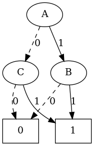
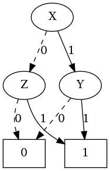

# Equivalence Checker Using ROBDD

## Introduction
This tool is designed to check the equivalence of two Boolean expressions using Reduced Ordered Binary Decision Diagrams (ROBDD). It includes a series of modules that extract variables, parse Boolean expressions, build ROBDD trees, visualize these trees as graphs and compare them using variable mapping and truth table generation.

## Features

### 1- Boolean Expression Parser Module
This module is divided into several functions, each handling a specific part of the parsing and evaluation process:

#### Logical Operators
Implementations for each Boolean operator are provided:
- `NOT(a)`: Logical NOT operation.
- `XOR(a, b)`: Exclusive OR operation.
- `AND(a, b)`: Logical AND operation.
- `OR(a, b)`: Logical OR operation.
- `NOR(a, b)`: Logical NOR operation.
- `NAND(a, b)`: Logical NAND operation.

#### Variable Extraction
- `extract_variables(expr)`: Extracts and returns a sorted list of unique variable names from the given Boolean expression.

#### Expression Parsing
- `parse_boolean_expression(expr)`: Main function to initiate the parsing of the given Boolean expression. It breaks down the expression into tokens and processes them to construct and evaluate the Boolean logic.

#### Parsing Details
The parsing process involves several nested functions designed to evaluate expressions based on the precedence of operations:
- `parse_factor()`: Handles individual factors in the expression, managing NOT operations and parentheses.
- `parse_term()`: Manages XOR operations.
- `parse_expression()`: Handles AND and OR operations, including combinations with NAND and NOR.

### Usage
To use this script, simply import and call `parse_boolean_expression` with a Boolean expression as a string:

```python
from boolean_parser import parse_boolean_expression

# Take care |~ represents NOR gate and &~ represents NAND gate
expression = "a & (b | !c)"
result = parse_boolean_expression(expression)
print(result)
#Output : AND(a, OR(b, NOT(c)))

expression = "a & (b | ~c)"
result = parse_boolean_expression(expression)
print(result)
#Output : AND(a, NOR(b, c))
```

### 2- Truth Table Module

This module generates a truth table for a given Boolean expression and compares two truth tables to determine if their corresponding expressions are equivalent.


#### Evaluate Parsed Expression
- `evaluate_parsed_expression(parsed_expr, var_values)`: Evaluates a parsed Boolean expression based on the given variable values. This function dynamically replaces variable placeholders in the parsed expression with actual Boolean values and evaluates the result.

#### Generate Truth Table
- `generate_truth_table(expression)`: Generates and prints a truth table for a specified Boolean expression. This function:
  - Extracts variables from the expression.
  - Parses the Boolean expression to a form suitable for evaluation.
  - Iterates over all possible combinations of truth values for the variables.
  - Evaluates the expression for each combination and prints the result.

#### Compare Truth Tables
- `compare_truth_tables(table1, table2)`: Compares two truth tables to check if they represent equivalent expressions. It returns `True` if the tables are equivalent, otherwise `False`.

### Usage

To generate a truth table for a Boolean expression:

```python
from truth_table import generate_truth_table

# Example Boolean expression
expression = "a & (b | !c)"
truth_table = generate_truth_table(expression)

# a b c | Result
# --------------
# 0 0 0 | 0
# 0 0 1 | 0
# 0 1 0 | 0
# 0 1 1 | 0
# 1 0 0 | 1
# 1 0 1 | 0
# 1 1 0 | 1
# 1 1 1 | 1
```

### 3- ROBDD Graph Construction and Manipulation Module
This module implements a Reduced Ordered Binary Decision Diagram (ROBDD) for representing and manipulating Boolean expressions. It includes utilities for constructing an ROBDD from a Boolean expression, comparing two ROBDDs and generating a visual representation of an ROBDD using DOT format.

#### **BDDNode Class**: 
- `BDDNode(var, high, low, terminal)` defines a node in the Binary Decision Diagram (BDD), which can either represent a variable or a terminal value (True/False).
#### **Shannon Expansion**: 
- `shannon_expansion(expr, var)` decomposes a Boolean expression to build the BDD by recursively applying Shannon expansion.
#### **Reduction Function**: 
- `reduction(node)` implements the reduction rules to simplify the BDD and cache nodes to avoid redundant subtrees.
#### **Expression Parsing**: 
- `parse_boolean_expression` function (from an boolean parser module) is used to parse Boolean expressions.
#### **Comparison of ROBDDs**: 
- `compare_bdds_with_variable_mapping(bdd1, bdd2, var_map=None)` allows comparing two ROBDDs while handling variable renaming, ensuring that functionally equivalent ROBDDs are identified.
#### **DOT Representation**: 
- `robdd_to_dot(robdd)` provides a function to convert an ROBDD into DOT format for visualization in graph tools like graphviz.

### Usage
```python
from graphviz import Source
from robdd_graph import generate_robdd, robdd_to_dot

expression_1 = "(A & B) | (!A & C)"
# The equivalent expression using De-Morgan 
expression_2 = "!((!X | !Y) & (X | !Z))"

robdd_1 = generate_robdd(expression_1)
robdd_2 = generate_robdd(expression_2)

dot_representation_1 = robdd_to_dot(robdd_1)
dot_representation_2 = robdd_to_dot(robdd_2)

src_1 = Source(dot_representation_1)
src_2 = Source(dot_representation_2)

src_1.render("robdd_1", format='png', cleanup=True)
src_2.render("robdd_2", format='png', cleanup=True)
```
<p align="center">
  
   
</p>


## Installation

### Prerequisites
- Python 3.8 or higher
- Graphviz for graph visualization

### Setup
Clone the repository and install the required Python packages:

```bash
git clone https://github.com/ahmd-kamel/ROBDD-Based-Equivalence-Checker.git
cd ROBDD-Based-Equivalence-Checker
pip install graphviz
python3 equivalence_checker.py "A&B" "A^C"
```